# Hosting a WordPress Website on AWS

Hi.

In this tutorial, we are going to learn how to host a WordPress website on AWS.

## Requirements

- An AWS Account;

- An active domain name.

## STEP 1: Create an AWS EC2 Instance

1. In Your AWS Management Console, Search for EC2 in the search bar, and click on the first option that appears. Then click on the Launch Instance button.

    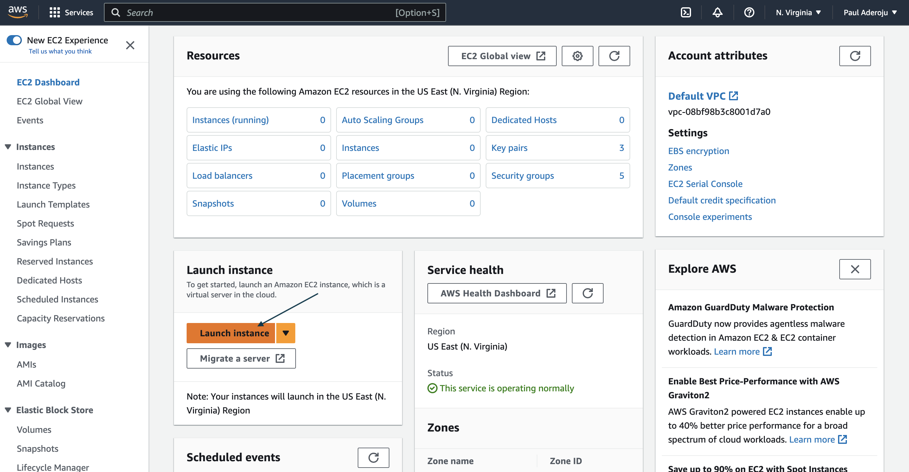

2. Fill out the fields like this:
    - Give your EC2 instance a name and select the Ubuntu AMI.
    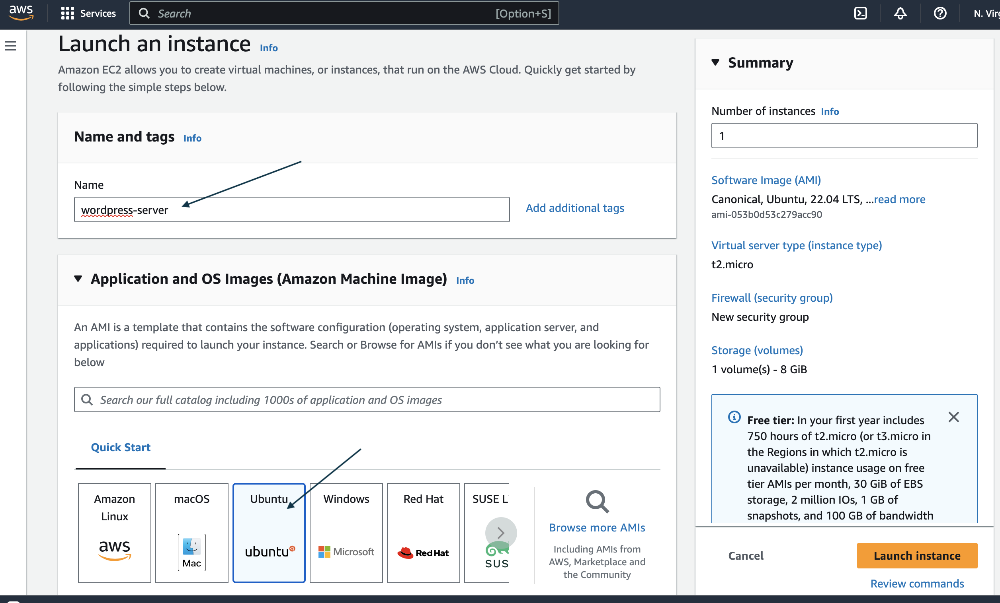

    - Select the t2.micro(free tier) instance type and create a keypair or use an already existing one.
    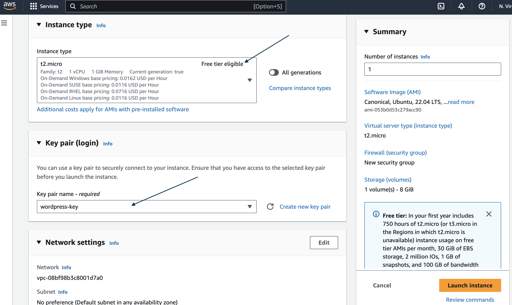

    - Create a new security group, and allow SSH, HTTPS and HTTP traffic from the Internet.
    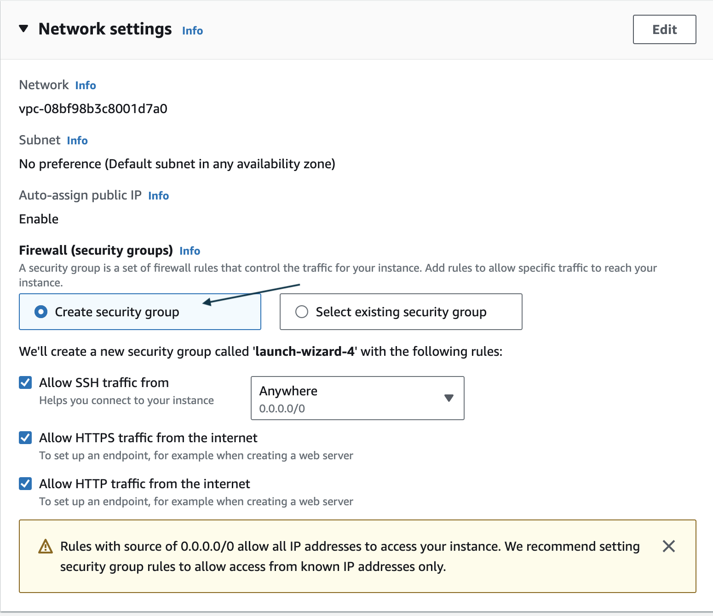

    - Configure your storage. 8GB is enough for this project. Launch your instance.
    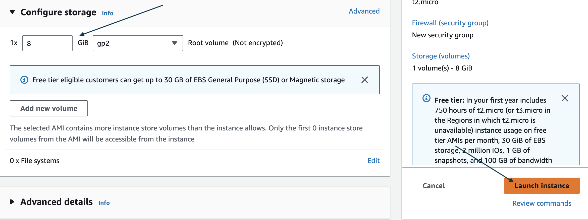

3. Allocate an Elatic IP and Associate it with your instance. An Elastic IP doesn't change unless you explicitly release it, making it useful for scenarios where you need a consistent IP address for your resource even if the resource is stopped and started.

    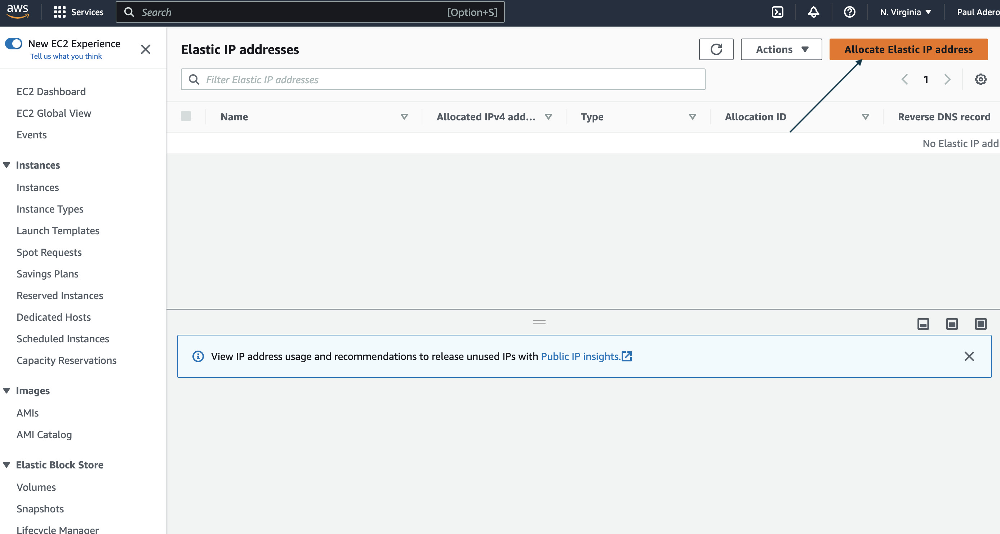
    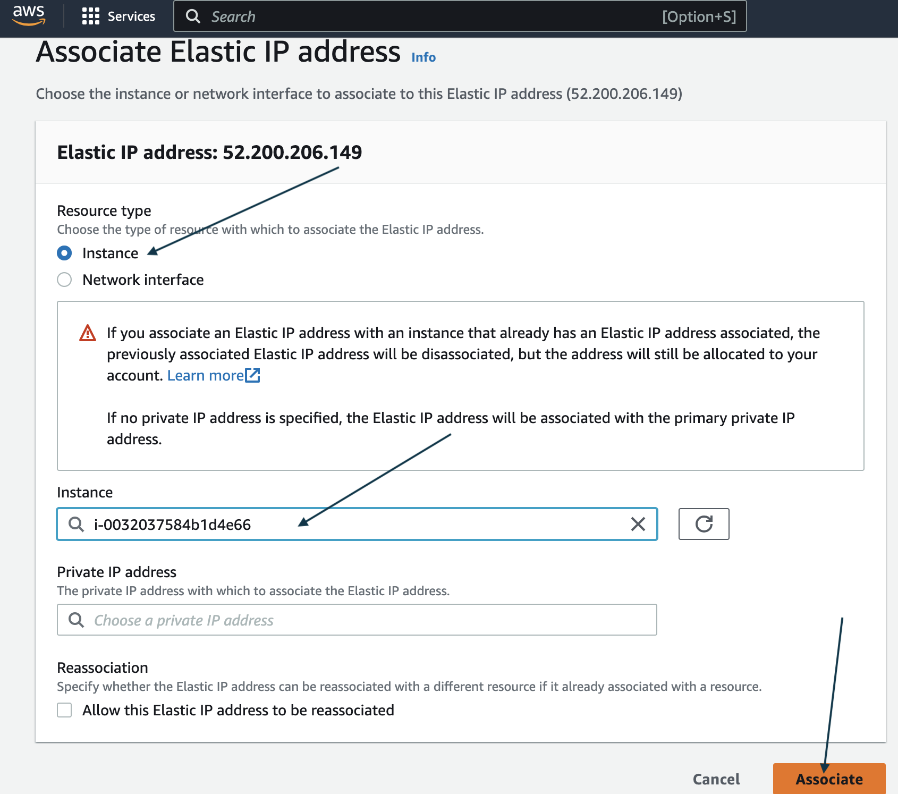

## STEP 2: SSH into your EC2 Instance

Securely login to your EC2 Instance. You can do that using a SSH Client or EC2 Instant Connect.

## STEP 3: Update and Upgrade the local package index on your system

Run the command:

```ubuntu
sudo apt update -y
sudo apt upgrade -y
```

## STEP 4: Install Apache2, PHP, MySQL

Run the command:

```ubuntu
sudo apt install apache2 -y
sudo apt install apache2 -y
sudo apt install mysql-server -y
```

## STEP 5: Change Mysql authentication plugin to a mysql native password

```ubuntu
sudo mysql -u root
```

1. Change authentication plugin

    ```sql
    ALTER USER 'root'@localhost IDENTIFIED WITH mysql_native_password BY 'Testpassword@123';
    ```

2. Create a seperate user other than root

    ```sql
    CREATE USER 'wp_user'@localhost IDENTIFIED BY 'Testpassword@123';
    ```

3. Create a Database for Wordpress. We'll call this database `wp`.

    ```sql
    CREATE DATABASE wp;
    ```

4. Assign all priviledges on the newly cretaed DB to the `wp_user` user;

    ```sql
    GRANT ALL PRIVILEGES ON wp.* TO 'wp_user'@localhost;
    ```

*Exit MySQL by pressing `Ctrl + d`*

## STEP 6: Download and Unzip Wordpress

1. cd to the `/tmp` directory

    ```ubuntu
    cd /tmp
    ```

2. Download wordpress

    ```ubuntu
    wget https://wordpress.org/latest.tar.gz
    ```

3. Unzip Wordpress. This will create a new folder called `wordpress`.

    ```ubuntu
    tar -xvf latest.tar.gz 
    ```

4. Move wordpress folder to document root of Apache2

    ```ubuntu
   sudo mv wordpress/ /var/www/html/
    ```

## STEP 7: Create a `wp-config.php file` from wordpress GUI

1. In the browser, go to `http://{ip_address}/wordpress`

    

2. Fill out the form with the information we used to create MySQL earlier, and submit:

    ```wordpress
    DATABASE Name: wp
    Usename: wp_user
    password: Testpassword@123
    DATABASE host: localhost
    table prefix: wp_
    ``````

    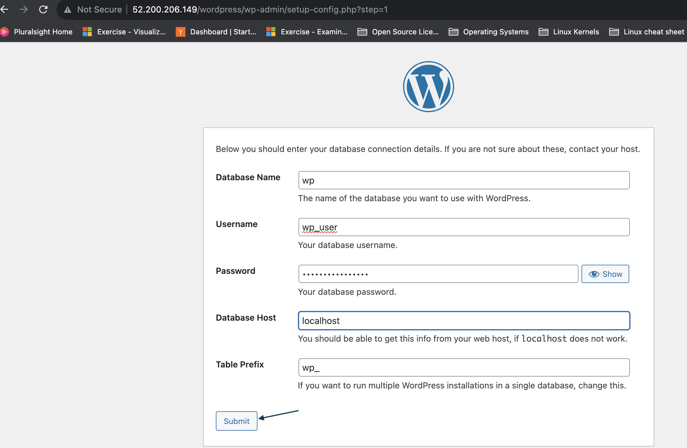

*It will throw an error saying `Unable to write to wp-config.php file`. Follow theses instructions to correct error.*

- Go to the `/var/www/html/wordpress` directory:

    ```ubuntu
    cd /var/www/html/wordpress
    ```

- Create a `wp-config.php file` and copy instructions from earlier error.

    ```ubuntu
    sudo vi wp-config.php
    ```

- Reload the browser and run installation.

- Fill the form on the next page.

*Go back to `http://{ip_address}/wordpress` and see the wordpress sites working*


## STEP 8: Modifying the Apache `000-default.conf` file

1. Go to Apache2 config folder

    ```ubuntu
    cd /etc/apache2/sites-available/
    ```

2. Open up sudo 000-default.conf file

    ```ubuntu
    sudo vi 000-default.conf 
    ```

Change `DocumentRoot /var/www/html/` to:

```ubuntu
 DocumentRoot /var/www/html/wordpress
```
   
Add:

```ubuntu
Alias '/wordpress/' '/var/www/html/wordpress/'
```

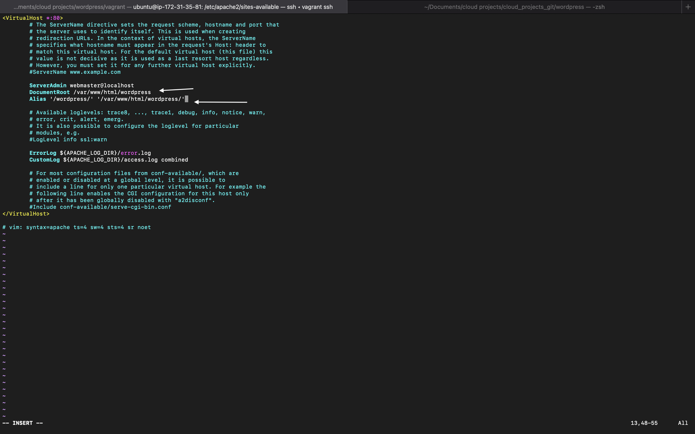

3. Restart apache2

```ubuntu
sudo systemctl restart apache2 
```

## STEP 9: Configuring your domain

1. Create an `A Type` DNS record. Copy your `ip address` from your ec2 and paste it to the new A type, set `TTL` to 60.

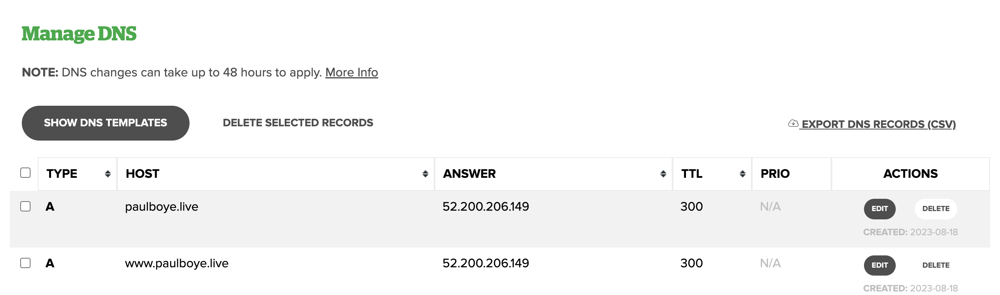

2. Add `ServerName` and `ServerAlias` to `000-default.conf` file

ServerName paulboye.live
ServerAlias www.paulboye.live

3. Restart apache2

```ubuntu
sudo systemctl restart apache2 
```

4. Login to wordpress admin: `http://{ip_address}/wordpress/wp-admin

Settings -> General -> 
```
WordPress Address (URL): http://{your-domain-name}
Site Address (URL): http://{your-domain-name}
```

*Click on `Save Changes`*

**Notice that the url of your wordpress site will have changed.**

## STEP 10: Install SSL Certificate

1. Install CertBot

```ubuntu
sudo apt install certbot python3-certbot-apache -y
```

2. Run Certbot and Follow prompts

```ubuntu
sudo certbot --apache
```

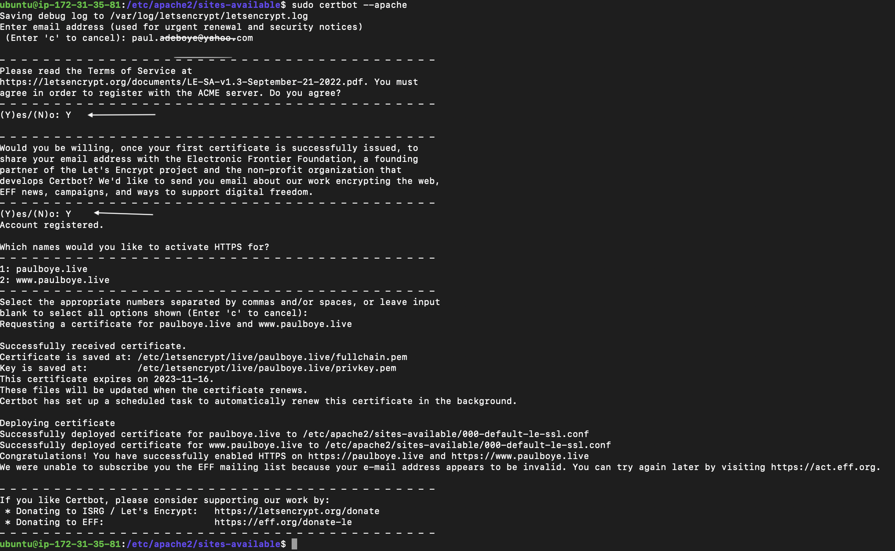

## Your Wordpress website is now up and running and has SSL certificates installed.

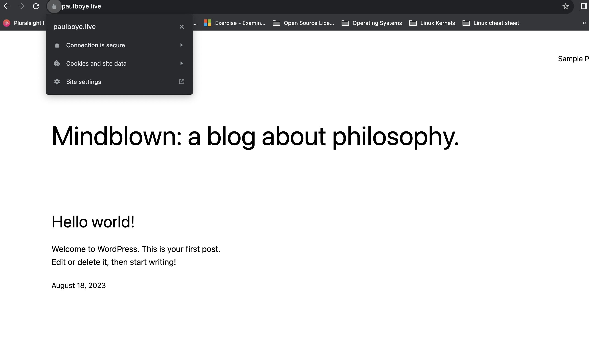